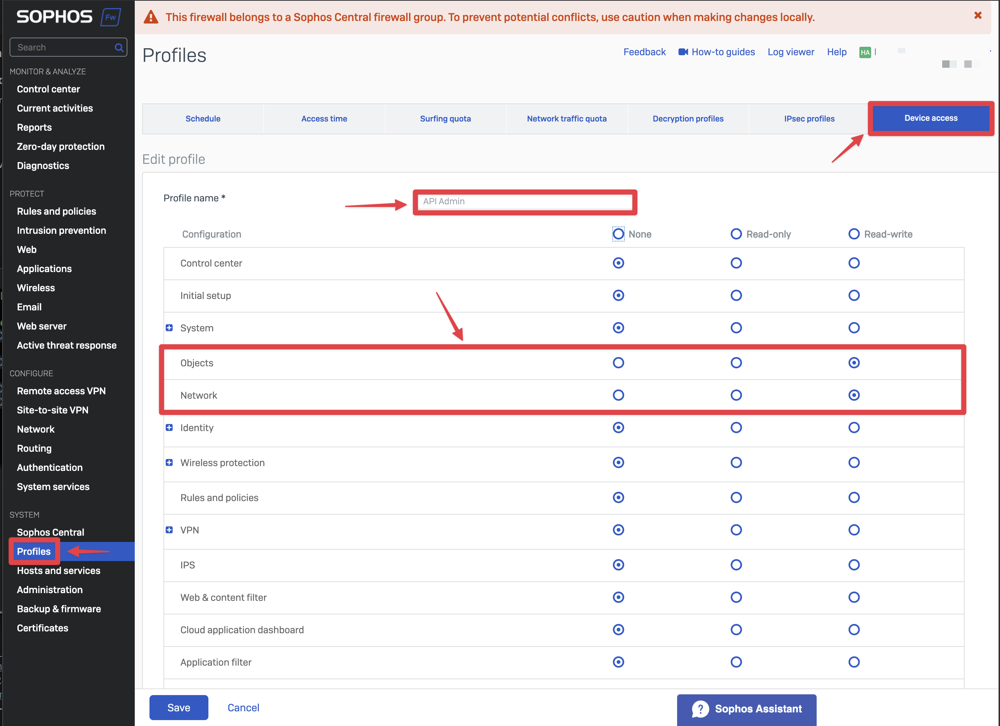

# Sophos-XG-API
Add a lists of IP or Network addresses from a CSV file to Sophos Firewall. 

I had a usecase where I needed to limit access to a API endpoint in my Sophos Firewall WAF. The IP addresses allowed to access the API was all from Microsoft and there was a lot of both IP addresses and network addresses to be added, so instead of manually creating the host objects in Sophos Firewall i decided to use their API.

1. Create a Device Access profile and a API user in Sophos Firewall.

to add a lot of Microsoft IP addresses to a IP Host Group in Sophos Firewall. 
